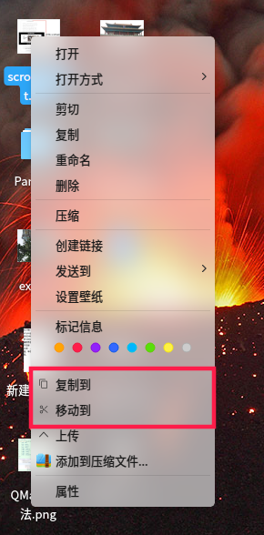
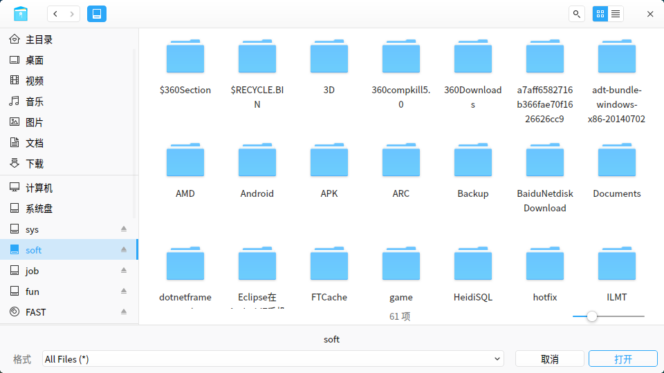

# 深度文管【复制到】【移动到】插件
## 安装
install.sh  
已知问题：生成desktop，复制到插件目录成功，结束 dde-file-manager-daemon 失败。





[官方文档](https://github.com/linuxdeepin/dde-file-manager-menu-oem)

## Desktop文件
```
[Desktop Entry]
Type=Application
Exec=/media/sonichy/job/HY/Linux/Qt/MoveTo/MoveTo cut %U
Icon=edit-cut
Name=移动到
X-DFM-MenuTypes=SingleFile;SingleDir;MultiFileDirs;
```

## 路径
*.desktop 放置到 /usr/share/deepin/dde-file-manager/oem-menuextensions/

## 加载
需要结束所有深度文管进程，再启动深度文管加载插件。